<div align="center">



**Stream 24/7 de audio ambiental procedural con rotación de escenas.**
Transmite a YouTube Live desde un servidor Linux con Docker — sin loops, sin samples, todo sintetizado en tiempo real.

[](https://www.youtube.com/@JackStar6677)
[](https://python.org)
[](https://docker.com)
[](LICENSE)

</div>

---

## ¿Qué es esto?

Un sistema de streaming ambiental completamente automatizado inspirado en proyectos como [SCP: Research Center Ambient](https://www.youtube.com/watch?v=lpAK3fosNIE) — esa sensación de estar dentro de una instalación viva, con sonidos de lluvia, ventiladores, pasos distantes, radio walkie-talkie y drones electrónicos que nunca se repiten.

La diferencia: **todo el audio se genera con código Python en tiempo real**. No hay archivos WAV de fondo. No hay loops. Cada segundo que escuchas es un chunk PCM recién sintetizado con `numpy`, `scipy` y `pedalboard` (Spotify).

## Características

- **6 escenas de video** rotando cada 2 horas con perfiles de audio radicalmente distintos
- **Audio 100% procedural** — síntesis de acordes, drones, melodías, viento, lluvia, agua, pasos, radio, ventiladores, golpes de puerta
- **Lluvia en tiempo real** — intensidad basada en clima real via Open-Meteo API (drizzle → tormenta)
- **HUD overlay en video** via ffmpeg `drawtext`: hora Santiago, escena, CPU/RAM, dispositivos, viewers
- El sonido evoluciona según:
  - Hora del día (6 fases: madrugada → noche)
  - Clima real (temperatura, humedad, viento, código de precipitación)
  - Dispositivos activos en red local (netalertx SQLite)
  - Carga del servidor (CPU, RAM)
  - Viewers en el directo (YouTube API)

## Las 6 escenas

| Escena | Audio | Sonidos únicos |
|--------|-------|----------------|
| 🛸 **Orbital Station** | Dark station — drones profundos, tenso | Radio walkie-talkie, ventiladores de servidor, dings metálicos |
| ❄ **Arctic Outpost** | Cristalino, frío, reverb amplio | Viento intenso × 1.8, nieve suave, campanas de hielo |
| 🌿 **Forest Station** | Cálido, orgánico, mayor | Lluvia en el bosque, agua fluyendo, campanas naturales |
| 🌊 **Deep Sea Base** | Graves extremos (27–55 Hz), presión | Burbujas, flujo de agua, sonar lento 280 Hz |
| ⛰ **Mountain Base** | Amplio, elevado, viento dominante | Lluvia de montaña, viento × 2.2, campanas de altitud |
| ☀ **Desert Heat** | Seco, mínimo reverb, disperso | Viento seco, campanas metálicas escasas |

## Architecture

```
┌──────────────────────────────────────────────────────────────┐
│                     star-ambient-stream                       │
│                                                              │
│  ┌─────────────────┐   PCM s16le   ┌──────────────────────┐  │
│  │  audio_engine   │ ──── pipe ──▶ │       ffmpeg         │  │
│  │  (numpy/scipy/  │               │  video loop + HUD    │  │
│  │   pedalboard)   │               │  drawtext overlay    │  │
│  └────────┬────────┘               └──────────┬───────────┘  │
│           │                                   │              │
│           ▼                                   ▼              │
│   /tmp/star_state.txt              RTMP → YouTube Live       │
│           │                                                  │
│  ┌────────▼────────┐   ┌─────────────────────────────────┐  │
│  │  hud_updater    │   │       stream_manager             │  │
│  │  (cada 1s)      │   │  • YouTube API (broadcast)       │  │
│  └─────────────────┘   │  • rotación de escenas cada 2h   │  │
│                        │  • poll viewers cada 60s         │  │
│                        │  • reinicio automático si muere  │  │
│                        └─────────────────────────────────┘  │
└──────────────────────────────────────────────────────────────┘
```

### IPC via `/tmp/`

| Archivo | Escrito por | Leído por | Contenido |
|---------|-------------|-----------|-----------|
| `star_scene.txt` | `stream_manager` | `audio_engine` | `orbital\|nieve\|bosque\|...` |
| `star_state.txt` | `audio_engine` | `hud_updater` | `LABEL\|cpu\|ram%\|devices` |
| `star_viewers.txt` | `stream_manager` | `audio_engine`, `hud_updater` | número de viewers |
| `star_hud{1,2,3}.txt` | `hud_updater` | `ffmpeg drawtext` | texto overlay |

## Síntesis de audio

El `audio_engine` genera chunks de 4 segundos (176,400 muestras a 44100 Hz) con estas capas:

```
Pad (acordes)    ─ 5-6 sines por chord, crossfade cada 20s
Sub-drone        ─ sine en root/2 con vibrato lento (mín. 55 Hz)
Viento           ─ ruido SOS bandpass modulado por brightness
Melodía          ─ síntesis ADSR con notas del conjunto de la escena
Bells            ─ 2 parciales con decay, espaciadas aleatoriamente
Sonar            ─ ping periódico, frecuencia varía por escena
─────── Ambiente ─────────────────────────────────────────────
Radio            ─ síntesis formante con estructura frase/sílaba
Ventiladores     ─ ruido SOS 112 Hz + 187 Hz con LFO lento
Pasos            ─ pares de transientes graves con delay natural
Dings metálicos  ─ 2 parciales con decay, poco frecuentes
Carrito          ─ rumble de baja frecuencia con envolvente
Agua             ─ ruido bandpass + burbujas (bosque/submarino)
Lluvia/nieve     ─ hiss filtrado + gotas individuales, modulado por clima
Knock puerta     ─ golpes metálicos/madera cada 2-8 minutos
```

**Pedalboard** (Spotify) aplicado al mix final: `HighpassFilter(55Hz) → Chorus → Reverb → Compressor → LowpassFilter → Gain`

Todos los parámetros hacen lerp suave hacia sus targets (velocidad × 15 al cambiar de escena).

## Setup

### 1. Credenciales YouTube Data API v3

1. [Google Cloud Console](https://console.cloud.google.com) → habilitar YouTube Data API v3
2. Credenciales OAuth → Aplicación de escritorio → descargar como `client_secrets.json`
3. Generar token (desde máquina con navegador):
   ```bash
   pip install google-auth-oauthlib
   python auth.py
   ```
4. Copiar `token.pickle` al servidor

### 2. Videos de escena

Coloca tus videos MP4 en `scenes/` con estos nombres exactos:
```
scenes/orbital.mp4    # módulo orbital, estación espacial
scenes/nieve.mp4      # outpost en la nieve
scenes/bosque.mp4     # bosque templado
scenes/submarina.mp4  # estación submarina
scenes/montana.mp4    # base de montaña
scenes/desierto.mp4   # desierto
```

Videos cortos (8-30s) que ffmpeg loopea con `-stream_loop -1`. Generados con **Veo3**, Sora, o cualquier herramienta de video IA. El audio original del video es ignorado — lo reemplaza el engine.

### 3. Levantar

```bash
# Copiar credenciales
cp token.pickle /opt/tu-ruta/
cp client_secrets.json /opt/tu-ruta/   # sólo si necesitas regen el token

# Build y levantar
docker compose build
docker compose up -d

# Logs en tiempo real
docker logs -f youtube_streamer
```

### 4. netalertx (opcional)

Para el conteo de dispositivos en red, el contenedor necesita acceso a:
```
/opt/stacks/netalertx/data/db/app.db
```
Agrégalo como volumen en `docker-compose.yml`.

## Configuration

`stream_manager.py`:
```python
SCENE_DURATION  = 2 * 3600    # segundos por escena (2h)
CYCLE_DURATION  = 11.5 * 3600 # duración del episodio antes de nuevo broadcast
SCENE_ORDER     = ['orbital', 'nieve', 'bosque', 'submarina', 'montana', 'desierto']
```

`audio_engine.py` → `SCENE_PROFILES`: ajusta `rain_base`, `wind_gain`, `radio_gain`, `reverb_base`, etc. por escena.

## Archivos

| Archivo | Descripción |
|---------|-------------|
| `audio_engine.py` | Motor de síntesis. Escribe PCM s16le a stdout. |
| `stream_manager.py` | Orquestador: YouTube API, rotación de escenas, monitoreo. |
| `hud_updater.py` | Actualiza overlay HUD cada segundo. |
| `generate_weather_ambient.py` | Utilidad standalone para generar WAV (no usado en streaming). |
| `check_status.py` | Diagnóstico del estado del stream. |
| `auth.py` | Genera `token.pickle` via OAuth. Ejecutar una vez. |
| `Dockerfile` | `python:3.12-slim` + ffmpeg + numpy + scipy + pedalboard. |
| `docker-compose.yml` | Monta `token.pickle` y `scenes/` como volúmenes. |

## Inspiración

- [SCP: Research Center Ambient](https://www.youtube.com/watch?v=lpAK3fosNIE) — el tipo de atmósfera que buscamos
- [pedalboard (Spotify)](https://github.com/spotify/pedalboard) — efectos de audio profesionales en Python
- [Open-Meteo](https://open-meteo.com) — API de clima gratuita sin key

## License

MIT — úsalo, fórkéalo, mejóralo.

<!-- Updated for 2026 active baseline maintenance -->
